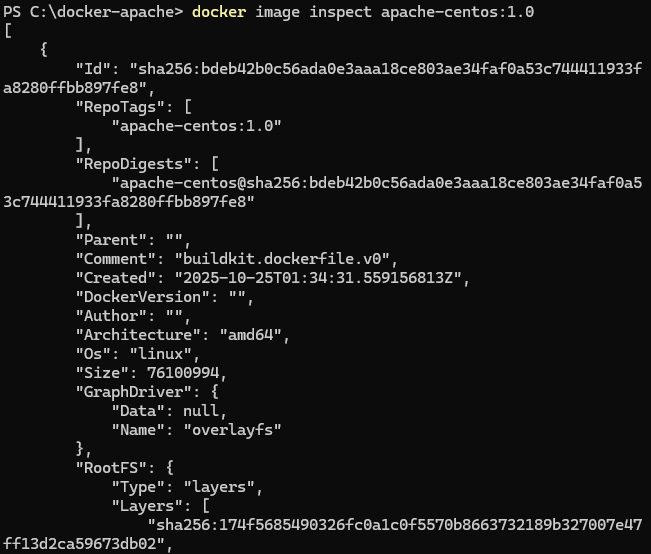

# Dockerfile
Un Dockerfile es un archivo de texto plano que contiene una serie de instrucciones que Docker utiliza para construir una imagen de contenedor Docker. Este conjunto de instrucciones define cómo se debe configurar y construir una imagen de contenedor, incluyendo qué sistema operativo base usar, qué software instalar, qué archivos copiar en el contenedor y cómo configurar el entorno de ejecución.
 


Tradicionalmente, el archivo docker no tiene extensión. Simplemente se denomina Dockerfile sin ningún tipo de extensión. Adicionalmente, los Dockerfiles pueden ser creados usando la extensión .dockerfile. Esto se utiliza cuando hay una necesidad de almacenar múltiples archivos docker en un solo directorio.
Las instrucciones en un Dockerfile son simples y están diseñadas para ser leídas y comprendidas fácilmente. 

### FROM 
Especifica la imagen base que se utilizará como punto de partida para construir la nueva imagen de Docker. Por ejemplo, FROM nginx:alpine significa que la nueva imagen se basará en la imagen oficial de Nginx que está etiquetada como "alpine". Al utilizar una imagen base existente, se heredan todas las configuraciones y software incluidos en esa imagen, lo que facilita la creación de nuevas imágenes sin tener que empezar desde cero.

### RUN
Ejecuta comandos en el contenedor durante el proceso de construcción de la imagen. Puedes usar esta instrucción para instalar software, configurar el entorno, o realizar cualquier otra tarea necesaria para preparar la imagen. Por ejemplo, RUN apt-get update && apt-get install -y <paquete> instalará un paquete utilizando el administrador de paquetes apt en una imagen basada en Ubuntu.

### COPY
Copia archivos o directorios desde la máquina host al sistema de archivos del contenedor. Se utiliza para agregar archivos, scripts u otros recursos necesarios para la aplicación en la imagen de contenedor. Por ejemplo, COPY ./mi-app /app copiará el directorio mi-app desde la máquina host al directorio /app en el contenedor.

### ADD
Copia archivos o directorios desde el sistema de archivos de la máquina host al sistema de archivos del contenedor. Aunque es similar a la instrucción COPY, ADD tiene algunas características adicionales, como la capacidad de descomprimir automáticamente archivos y de copiar archivos desde una URL remota.

### CMD 
Define el comando predeterminado que se ejecutará cuando se inicie el contenedor. Puede haber solo una instrucción CMD en un Dockerfile. Si se proporciona más de una, solo la última tendrá efecto. Por ejemplo, CMD ["nginx", "-g", "daemon off;"] ejecutará el servidor web Nginx en modo daemon cuando se inicie el contenedor.

### ENTRYPOINT
Configura el comando o el script que se ejecutará cuando se inicie un contenedor basado en la imagen. A diferencia de la instrucción CMD, que especifica el comando predeterminado que se ejecutará y que puede ser sobrescrito desde la línea de comandos al iniciar el contenedor, ENTRYPOINT establece un comando que no se puede sobrescribir fácilmente al iniciar el contenedor.
Es importante destacar que, si se proporciona un comando en la línea de comandos al iniciar el contenedor (por ejemplo, docker run <imagen> <comando>), este comando se agregará como argumentos al comando especificado en ENTRYPOINT, en lugar de sobrescribirlo. Esto permite que el contenedor sea más versátil y se adapte a diferentes necesidades de uso.

### EXPOSE
Informa a Docker que el contenedor escuchará en un puerto específico en tiempo de ejecución. No abre realmente el puerto, solo documenta que la aplicación dentro del contenedor puede usar dicho puerto. Por ejemplo, EXPOSE 80 expone el puerto 80 en el contenedor, lo que permite que se acceda a la aplicación que se esté ejecutando en ese puerto desde fuera del contenedor.

### ENV
Define variables de entorno dentro del contenedor. Las variables de entorno definidas con ENV estarán disponibles para cualquier proceso en el contenedor durante su ejecución. Por ejemplo, ENV MYSQL_ROOT_PASSWORD=password define una variable de entorno llamada MYSQL_ROOT_PASSWORD con el valor password.

### VOLUME 
Esta instrucción se se utiliza para definir un punto de montaje para volúmenes dentro del contenedor.

##  Para construir una imagen de Docker a partir de un Dockerfile
```
docker build -t <nombre imagen>:<tag> .
```
- **-t** esta opción se utiliza para etiquetar la imagen que se está construyendo con un nombre y una versión.
- <nombre_imagen>:<tag> por ejemplo: myapp:1.0
- **.** este punto indica al comando docker build que busque el Dockerfile en el directorio actual, es decir especifica la ubicación del contexto de la construcción que incluye el Dockerfile y cualquier otro archivo necesario para la construcción de la imagen.

## Ejemplo
### Colocar las siguientes instrucciones en un Dockerfile, 


- apachectl: Es el script de control para el servidor web Apache. Se utiliza para iniciar, detener y controlar el servidor web.
- -D FOREGROUND: Esta opción le dice a Apache que se ejecute en primer plano. Por defecto, Apache se ejecuta como un servicio en segundo plano. Sin embargo, en un contenedor Docker, es preferible que el proceso principal (en este caso, Apache) se ejecute en primer plano para que Docker pueda monitorear el estado del proceso. Si Apache se ejecutara en segundo plano, Docker no podría saber si el servidor web está funcionando correctamente o no.

 
### Ejecutar el archivo Dockerfile y construir una imagen en la versión 1.0
No olvides verificar en qué directorio se encuentra el archivo Dockerfile
```
FROM centos:7
RUN sed -i 's|mirrorlist=|#mirrorlist=|g' /etc/yum.repos.d/CentOS-*.repo && \
    sed -i 's|#baseurl=http://mirror.centos.org|baseurl=http://vault.centos.org|g' /etc/yum.repos.d/CentOS-*.repo
RUN yum clean all && yum makecache
RUN yum install -y httpd
COPY ./web /var/www/html
EXPOSE 80
CMD ["/usr/sbin/httpd", "-D", "FOREGROUND"]

```

```
docker build -t apache-centos:1.0 .
```


**¿Cuántos pasos se han ejecutado?**
En total hubo 7 líneas en el archivo de Docker, pero se completaron 11 pasos. 

### Inspeccionar la imagen creada
```
docker image inspect apache-centos:1.0
```



**Modificar el archivo index.html para incluir su nombre y luego crear una nueva versión de la imagen anterior**
**¿Cuántos pasos se han ejecutado? ¿Observa algo diferente en la creación de la imagen**
```
docker image inspect apache-centos:2.0
```


Se ejecutaron los mismos pasos. Lo unico que se vuelve a construit es la parte modificada (index.html). 


## Mecanismo de caché
Docker usa un mecanismo de caché cuando crea imágenes para acelerar el proceso de construcción y evitar la repetición de pasos que no han cambiado. Cada instrucción en un Dockerfile crea una capa en la imagen final. Docker intenta reutilizar las capas de una construcción anterior si no han cambiado, lo que reduce significativamente el tiempo de construcción.

- Instrucción FROM: Si la imagen base ya está en el sistema, Docker la reutiliza.
- Instrucciones de configuración (ENV, RUN, COPY, etc.): Docker verifica si alguna instrucción ha cambiado. Si no, reutiliza la capa correspondiente de la caché.
- Instrucción COPY y ADD: Si los archivos copiados no han cambiado, Docker reutiliza la capa de caché correspondiente.


### Crear un contenedor a partir de las imagen creada, mapear todos los puertos
```
docker run -d -P --name apache-server apache-centos:1.0
```

### ¿Con que puerto host se está realizando el mapeo?


Mapeó el puerto 80 del contenedor al puerto 32768 del host.

**¿Qué es una imagen huérfana?**
Llamada como dangling image, es dicha imagen que no tiene un tag y tampoco se encuentra asociado a ningún contenedor. Esto suele suceder cuando se interrumpe la construcción de la imagen, se eliminan contenedores o se reconstruye la imagen y la versión anterior no tiene una referencia. Deben ser limpiadas con regularidad. 

### Identificar imágenes huérfanas
```
docker images -f "dangling=true"
```

### Listar los IDS de las imágenes huérfanas
```
docker images -f "dangling=true" -q
```

### Eliminar imágenes huérfanas
Este comando eliminará todas las imágenes que no estén asociadas a ningún contenedor en ejecución. Antes de ejecutarlo, asegúrate de revisar las imágenes que serán eliminadas para evitar la pérdida de imágenes importantes. 
```
docker image prune
```

### Para Ejecutar un archivo Dockerfile que tiene otro nombre
```
docker build -t <nombre imagen>:<tag> -f <ruta y nombre del Dockerfile> .
```

## Por ejemplo
docker build -t imagen:1.0 -f Dockerfile-custom .


